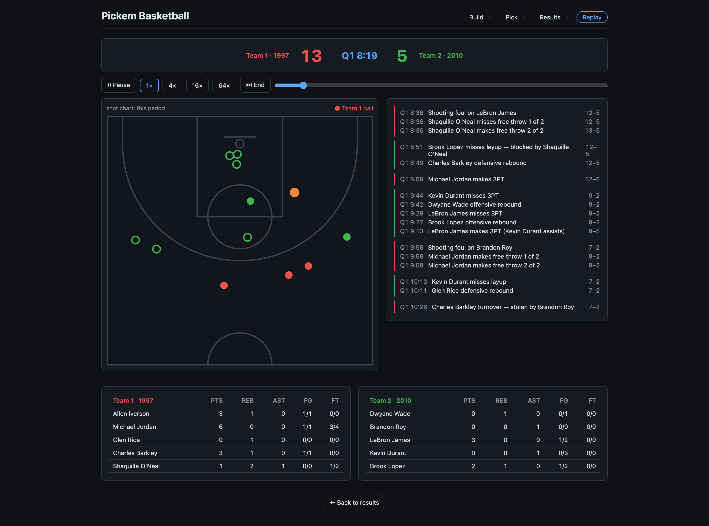

# Pickem Basketball

Build teams of NBA players from any season, lock your pick on the winner, and settle it with an event-sourced, deterministic game engine — then replay any simulated game play-by-play on a rendered court.



## Quick Start

```sh
bun install
bun run dev
```

Open `http://localhost:3099` — build two rosters (PG/SG/SF/PF/C from any season), lock your picks, simulate 1000 games, then replay any of them play-by-play.

The UI (`src/ui/`) is React via Bun's native HTML imports — no separate bundler. Hash-routed (`#/`, `#/matchup`, `#/replay`) with team ids and seeds in the URL, so every matchup, result, and replay is refresh-safe and deep-linkable. Pick records and saved rosters live in `localStorage`; the server is stateless.

## Commands

| Command | Purpose |
|---------|---------|
| `bun run dev` | Start dev server with hot reload |
| `bun test` | Run engine and API tests |
| `bun run build-data` | Rebuild `players.json` from CSVs |

## API

| Method | Path | Description |
|--------|------|-------------|
| `GET` | `/api/years` | All available seasons |
| `GET` | `/api/players?year=2024&position=PG` | Players filtered by year and position |
| `GET` | `/api/players?ids=id1,id2,...` | Players by id, in request order |
| `POST` | `/api/simulate` | Run 1000 simulations. Body: `{ team1: [...], team2: [...], baseSeed? }` — same `baseSeed` reproduces the run |
| `GET` | `/api/game?team1=id1,...&team2=id1,...&seed=N` | Re-simulate one game, returning its full event timeline and box score |

## Data

9,243 players across 28 seasons (1997–2024). Sources:

- **1997–2010:** Brescou/NBA-dataset-stats-player-team
- **2011–2024:** NocturneBear/NBA-Data-2010-2024

Players with fewer than 10 games in a season are excluded.

## Simulation Detail

The engine (`src/engine/`) is event-sourced: each game is a timeline of timestamped events (shots, rebounds, assists, steals, blocks, turnovers, fouls, free throws), each carrying the running score, game clock, and current possession. Box scores and results are derived by folding over the timeline.

- **Real clock:** 4 × 12-minute quarters, 5-minute overtimes until a winner. Possessions emerge from sampled action times under a 24s shot clock; offensive rebounds reset to 14s.
- **Deterministic:** every game is seeded — the same matchup and seed reproduce the identical timeline. `POST /api/simulate` plays 1000 seeded games and reports win probability, average scores, per-game `{seed, scores}`, and averaged per-player box lines; `GET /api/game` replays any of them in full (team1 = home).
- **Attribution:** shooters by FGA share, assists by AST share, steals/blocks/rebounds contested via individual rates. Tuning knobs live in `src/engine/constants.ts`.

Court coordinates in the replay UI are synthesized deterministically per event (`src/ui/court.tsx`) — presentational only, since the source data has no shot locations.
